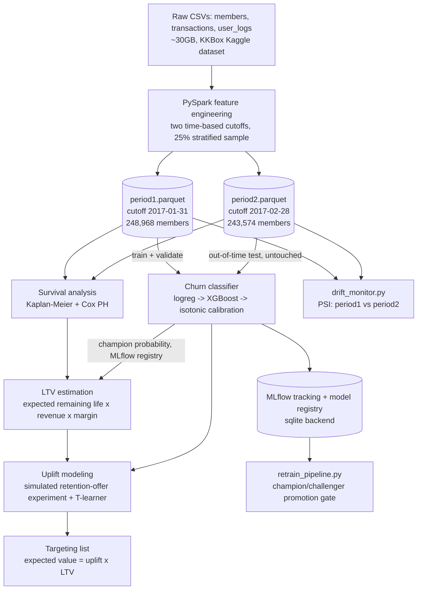
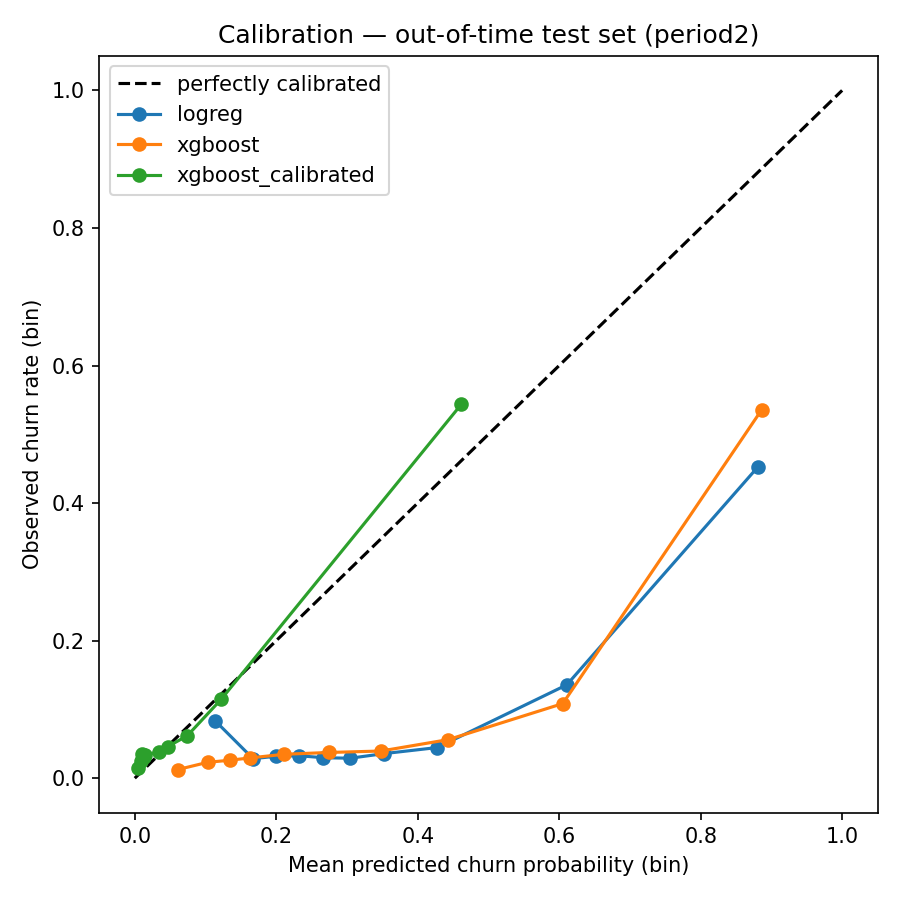
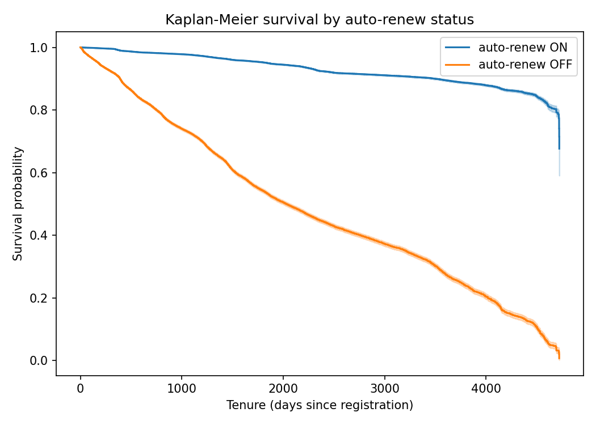
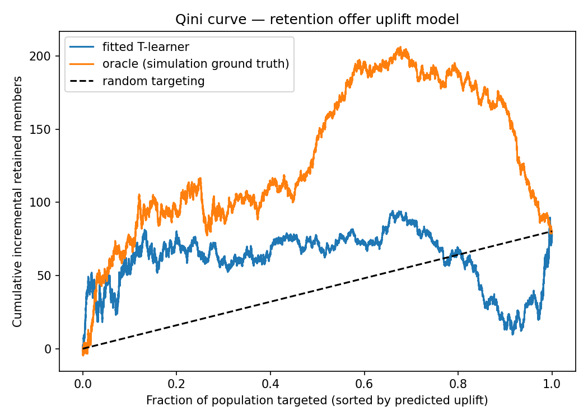

# Subscriber Retention & Lifetime Value System

An end-to-end retention analytics system built on the
[KKBox Churn Prediction Challenge](https://www.kaggle.com/c/kkbox-churn-prediction-challenge)
dataset (WSDM 2018): distributed feature engineering over the raw event logs, a churn
classifier, survival analysis, LTV estimation, an uplift/causal layer for retention offers, and
MLflow/testing/Docker scaffolding for production operation.

## Problem framing

A subscription business rarely loses subscribers all at once — retention risk builds up through
a chain of smaller signals: a lapsed auto-renew, a decline in engagement, a plan downgrade.
Retention analytics decomposes into three distinct modeling problems, treated here as separate
components rather than one model doing all three:

1. **Who is about to churn?** — a classification problem, scored on a recurring basis.
2. **How long will a subscriber likely remain, and what shape does that risk take over their
   full tenure?** — a survival problem, not a single point-in-time score.
3. **Given a limited retention-offer budget, who should receive one?** — a causal problem:
   not "who is at risk," but "who is at risk *and* would respond to an offer."

The architecture below addresses each in turn and combines the outputs into a single targeting
list.

## Architecture



Each box is one script in `src/`, runnable independently:

| Stage | Script | What it does |
|---|---|---|
| 1 | `feature_engineering.py` | PySpark: raw CSVs → two time-cutoff feature tables |
| 2 | `churn_model.py` | Logistic regression → XGBoost → calibration, time-based OOT eval |
| 3 | `survival_analysis.py` | Kaplan-Meier + Cox PH, compared against the classifier |
| 4 | `ltv_estimation.py` | Expected remaining lifetime × revenue × margin |
| 5 | `uplift_model.py` | Simulated retention-offer experiment, T-learner, Qini evaluation |
| 6 | `retrain_pipeline.py` / `drift_monitor.py` | Champion/challenger retraining gate, PSI drift checks |

## Setup

```bash
# 1. Data: download the KKBox Churn Prediction Challenge from Kaggle and extract it
#    so `data/` (a symlink in this repo) points at the folder containing
#    members_v3.csv, train.csv, transactions.csv, user_logs.csv, and a
#    data/churn_comp_refresh/ subfolder with the *_v2.csv files.

# 2. Environment (macOS/Homebrew shown; see Dockerfile for a from-scratch env)
brew install openjdk@17 python@3.11
python3.11 -m venv .venv && source .venv/bin/activate
pip install -r requirements.txt

# 3. Run the pipeline in order
python -m src.feature_engineering   # ~15 min on an 8-core/16GB laptop; writes artifacts/features/*.parquet
python -m src.churn_model
python -m src.survival_analysis
python -m src.ltv_estimation
python -m src.uplift_model
python -m src.drift_monitor
python -m src.retrain_pipeline      # champion/challenger promotion gate

# Tests (fast — small in-memory Spark DataFrames, no raw data needed)
pytest tests/ -v

# MLflow UI (inspect runs, models, the registry)
mlflow ui --backend-store-uri sqlite:///mlflow.db
```

Result figures referenced below are checked into `docs/images/`, generated by the commands
above and reproducible by re-running them.

## Why time-based splitting matters

The dataset ships two labeled snapshots of the same subscriber base a month apart — `train.csv`
(churn defined around Feb 2017) and `train_v2.csv` (around March 2017), which enables a direct
comparison between a random split and a genuine deployment scenario:

- **Time-based OOT split**: train on `period1` (cutoff 2017-01-31), evaluate on `period2`
  (cutoff 2017-02-28) — a period the model never saw, matching how the model would score a
  future cohort in production. **ROC-AUC 0.843.**
- **Naive random split** (identical model architecture and training-set size, only the split
  strategy changes): pool both periods and split randomly 80/20. **ROC-AUC 0.903.**

The random split overstates real-world performance by **6 points of AUC**. Two properties of
this data drive the gap: members can appear in both periods, so a random split lets the model
partially fit member-specific behavior it will not see again for a genuinely new member; and
the random split evaluates on the same time window it trained on, which hides the real
distribution shift present in this data — churn rate moves from **6.41% to 9.04%** between the
two periods. Only a held-out future period exposes whether a model survives that kind of shift.

## Churn classification

Logistic regression baseline → XGBoost, evaluated on the untouched out-of-time period:

| Model | ROC-AUC | PR-AUC | Log loss | Brier |
|---|---|---|---|---|
| Logistic regression | 0.758 | 0.441 | 0.506 | 0.153 |
| XGBoost | 0.843 | 0.566 | 0.426 | 0.131 |
| XGBoost + isotonic calibration | 0.843 | 0.553 | **0.222** | **0.056** |



XGBoost is the clear ranking improvement over the linear baseline. Calibration is a separate
axis: the calibration curve above shows raw XGBoost is overconfident at the high end — members
scored at ~88% churn probability actually churn at ~54% — and isotonic calibration (fit on the
validation set, evaluated on the OOT set) pulls predictions back toward the diagonal, roughly
halving log loss and Brier score at essentially no cost to ranking quality (PR-AUC 0.566 →
0.553). The registered "champion" model is the raw (uncalibrated) XGBoost model, selected by
PR-AUC, because downstream consumers in this system (LTV segmentation, uplift targeting) only
require a *rank* of risk, not a literal probability; a consumer computing a dollar figure
directly as `P(churn) × revenue` would champion the calibrated model instead, at that small
PR-AUC cost.

Class imbalance (6–9% churn) is handled via `class_weight="balanced"` / `scale_pos_weight`
rather than resampling.

## Survival analysis vs. the classifier

The classifier answers "will this member churn in the ~30-day window `is_churn` is defined
over?" — a fixed-horizon point prediction. Survival analysis answers a different question:
given how long a member has already lasted, what does their full forward retention curve look
like, and which covariates shift that entire curve rather than a single point on it?

Kaplan-Meier and Cox PH are fit on 435,091 pooled (member, period) rows, treating each as a
single cross-sectional observation — `duration = tenure_days`, `event = is_churn`. This
represents each member's current tenure and churn status at one point in time rather than a
reconstructed multi-episode subscription history (see Limitations).



**Finding:** `is_auto_renew` dominates every other covariate — hazard ratio **0.25**, a ~75%
reduction in churn hazard, visible above as the two survival curves diverge almost immediately
and never reconverge. Continuous covariates are standardized before fitting so coefficients are
comparable as "hazard change per 1 standard deviation" (covariates in this dataset span very
different scales — `total_secs_last_90d` ranges into the millions while `completion_ratio`
ranges over [0, 1] — so standardization is required for the coefficients to be interpretable
side by side). After standardization, the next largest effects are `days_since_last_transaction`
(HR 1.13/SD) and `active_days_last_90d` (HR 0.89/SD).

Cox's concordance (0.81) and the classifier's in-sample ROC-AUC (0.92) reflect comparable
discriminative power from two different modeling lenses, with moderate rank agreement between
them (Spearman ρ = 0.41) — correlated but not redundant. The classifier is the right tool for
prioritizing weekly review lists; the survival model is the right tool for characterizing a
subscriber's expected retention trajectory and identifying which single lever — auto-renew
enrollment, above all others — shifts that trajectory the most.

## LTV estimation

Expected remaining lifetime is derived from the fitted Cox model's individual survival function
(`S_i(t) = S_0(t)^θ_i`), integrated from a member's current tenure to a horizon capped at the
longest tenure observed in the training data. LTV = expected remaining days × daily revenue
(from each member's most recent plan) × an assumed 35% gross margin — the dataset provides
revenue but no cost data, so margin is a configurable placeholder
(`config.ASSUMED_GROSS_MARGIN_RATE`) for a figure that would be supplied by finance in
production.

Crossing LTV with the champion classifier's churn probability, both by percentile rank rather
than raw value (tree-ensemble predictions are frequently tied, which makes rank-based splitting
the robust choice), produces four retention-priority segments:

| Segment | Members | Total LTV | Avg LTV |
|---|---|---|---|
| High value, at risk | 124,377 | $740M | $5,950 |
| High value, stable | 93,169 | $495M | $5,315 |
| Low value, at risk | 93,169 | $291M | $3,124 |
| Low value, stable | 124,376 | $446M | $3,584 |

"High value, at risk" is the priority segment for a retention budget — but LTV × risk alone
does not indicate who would actually respond to an offer, which is what the uplift layer adds.

## Uplift / causal modeling

The KKBox dataset does not contain a retention-offer experiment. To demonstrate uplift
modeling on realistic data, `uplift_model.py` **simulates** a randomized offer on top of real
covariates and real historical churn outcomes. A treatment-effect function
(`true_treatment_effect()`) produces the four classic uplift segments — persuadables (declining
engagement, near a renewal decision point), sure things (already loyal/auto-renewing), lost
causes (dormant for roughly a year), and a small sleeping-dogs segment (very new members, where
an early offer can mildly backfire) — and a potential-outcomes simulation (`Y0` = actual
historical outcome, `Y1` = `Y0` adjusted by the treatment effect, `T` = simulated random
assignment, observed = `Y1` if treated else `Y0`) produces one outcome per member, matching how
a real experiment generates data. Results in this section characterize the modeling method
applied to this simulated experiment, not a business finding about real KKBox users.

An econml `TLearner` (XGBoost regressors, one per treatment arm) estimates individual treatment
effects. A T-learner is appropriate here because treatment is randomized by construction — there
is no confounding to adjust for, so the simplest valid estimator is used. An observational
deployment, where offers are targeted rather than randomized, would require a doubly-robust or
DML-based estimator instead, since treatment assignment would then correlate with covariates.



Evaluated on a held-out split (stratified on treatment assignment):

| Ranking | Qini coefficient |
|---|---|
| Random targeting (sanity check) | -1.8 |
| Fitted T-learner | **20.6** |
| Oracle (true simulated effect, an upper bound only knowable in simulation) | 89.6 |

The fitted model captures roughly a quarter of the theoretical maximum targeting benefit.

**Business interpretation:** the targeting list ranks members by
`expected_value_of_offer = predicted_uplift × LTV` — not uplift alone (a persuadable with
minimal remaining LTV is low priority) and not LTV alone (a loyal high-LTV member who would
retain regardless does not need an offer). In production this model would be deployed behind a
randomized holdout — score the full population, offer the top-N by predicted uplift, withhold a
random control slice from that top-N — and the resulting live Qini curve, not a single offline
evaluation, would validate or retire the model on a recurring basis, consistent with standard
A/B testing practice.

## Production ML practices

- **MLflow tracking + model registry** (`mlflow_utils.py`), backed by SQLite
  (`sqlite:///mlflow.db`) rather than the default local file store, which provides a Model
  Registry (versioning, a `champion` alias) — the registry requires a database-backed store. A
  production deployment points this at Postgres; no other code changes.
- **Champion/challenger retraining** (`retrain_pipeline.py`): a scheduled retrain does not
  auto-promote its own output. It trains a candidate, evaluates it on the same OOT metric the
  current champion was evaluated on, and only moves the `champion` alias if the candidate is at
  least as good within a small tolerance — otherwise the candidate is registered for audit
  history while production traffic remains on the existing champion.
- **Drift monitoring** (`drift_monitor.py`): Population Stability Index per feature, with bin
  edges fixed from the reference (training) distribution so a shift cannot be masked by
  redefining the bins around it. Run against the real feature tables, one feature
  (`days_since_last_transaction`, PSI 0.117) crosses the moderate-drift threshold; the remainder
  are stable, consistent with the period-over-period churn-rate shift documented above.
- **Unit tests** (`tests/test_feature_engineering.py`): six tests on small, hand-built Spark
  DataFrames rather than the full dataset, covering cutoff leakage, window aggregation
  correctness, and handling of the dataset's dirty `bd`/age field. A session-scoped Spark
  fixture keeps the suite fast.
- **Docker**: `python:3.11-slim` + `openjdk-17-jre-headless`, so a single image can run any
  stage depending on which volumes are mounted. Reviewed for correctness; not build-verified in
  this development environment (no Docker runtime available) — recommended as a CI step before
  deployment.

## Limitations / what would change at production scale

- **Sampled, not full, population.** `feature_engineering.py` samples 25% of members
  (stratified by churn label) prior to aggregation (`config.py`). This still requires a full
  distributed scan of the 28GB `user_logs.csv` (no columnar predicate pushdown on CSV), so the
  Spark stage reflects genuine large-scale processing, but a production deployment would run the
  unsampled pipeline on a cluster (EMR/Dataproc/Databricks) rather than a single machine.
- **Single-snapshot survival analysis.** Each (member, period) row is treated as one
  duration/event observation rather than a reconstructed multi-episode subscription history. A
  production version would model time-varying covariates and recurrent events from the full
  transaction log.
- **LTV horizon cap.** Expected remaining lifetime is estimated only out to the longest tenure
  observed in training data; beyond that horizon the model implicitly assumes a flat hazard
  rather than extrapolating an unobserved shape. This affects the longest-tenured members most.
- **Uplift layer is fully simulated.** A production deployment requires an actual experiment,
  or an observational estimator (e.g., DML) suited to non-randomized historical targeting,
  before these results inform spend.
- **`transactions_v2.csv` overlap with `transactions.csv`** is resolved by exact-row
  deduplication, which would not catch a genuinely distinct transaction recorded with slightly
  different values for the same member/date across both files.
- **Gross margin is an assumption, not a measured figure** — the dataset provides revenue but
  not cost, so LTV dollar values are only as accurate as `config.ASSUMED_GROSS_MARGIN_RATE`,
  which production would replace with a finance-supplied number.
- **Docker image is not build-verified** in this environment; recommended as a CI check before
  deployment.
