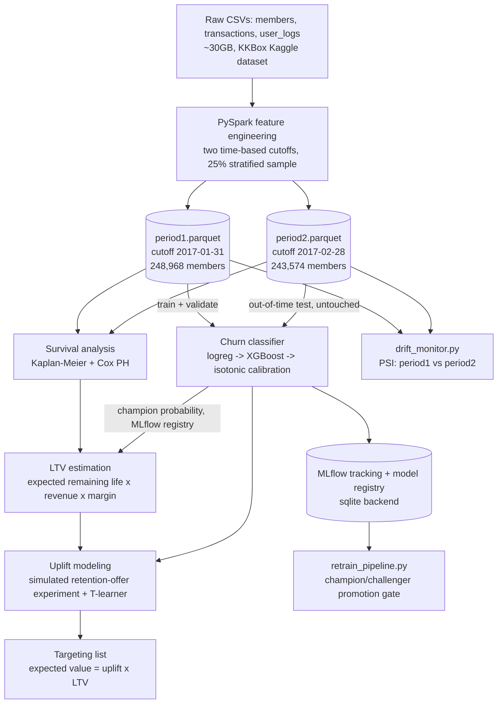

# Subscriber Retention & Lifetime Value System

A portfolio project built for a **Data Scientist II — Retention** application (Commerce &
Growth Analytics, streaming subscriptions). It's an end-to-end retention analytics stack on
the [KKBox Churn Prediction Challenge](https://www.kaggle.com/c/kkbox-churn-prediction-challenge)
dataset (WSDM 2018): distributed feature engineering over the raw event logs, a churn
classifier, survival analysis, LTV estimation, an uplift/causal layer for retention offers,
and the MLflow/testing/Docker scaffolding around it.

Every design decision below is deliberate and (I hope) defensible in an interview — including
the ones that turned out to be bugs during development, which are left in the commit history
on purpose rather than squashed away.

## Problem framing

A streaming subscription business doesn't lose subscribers all at once — it loses them through
a chain of smaller decisions: a lapsed auto-renew, a quiet drop in listening, a support
interaction that goes nowhere. Retention work sits on top of three different questions that
this project treats as genuinely different modeling problems, not one model wearing three hats:

1. **Who is about to churn?** (a classification problem, scored regularly)
2. **How long will a subscriber likely stick around, and what shape does that risk take over
   their whole tenure?** (a survival problem, not a single point-in-time score)
3. **Given a limited retention-offer budget, who should actually receive one?** (a causal
   problem — not "who's at risk," but "who's at risk *and* would respond to an offer")

The architecture below answers each in turn, then ties them together into one targeting list.

## Architecture



Each box is one script in `src/`, runnable independently:

| Stage | Script | What it does |
|---|---|---|
| 1 | `feature_engineering.py` | PySpark: raw CSVs → two time-cutoff feature tables |
| 2 | `churn_model.py` | Logistic regression → XGBoost → calibration, time-based OOT eval |
| 3 | `survival_analysis.py` | Kaplan-Meier + Cox PH, compared against the classifier |
| 4 | `ltv_estimation.py` | Expected remaining lifetime × revenue × margin |
| 5 | `uplift_model.py` | Simulated retention-offer experiment, T-learner, Qini evaluation |
| 6 | `retrain_pipeline.py` / `drift_monitor.py` | Champion/challenger retraining gate, PSI drift checks |

## Setup

```bash
# 1. Data: download the KKBox Churn Prediction Challenge from Kaggle and extract it
#    so `data/` (a symlink in this repo) points at the folder containing
#    members_v3.csv, train.csv, transactions.csv, user_logs.csv, and a
#    data/churn_comp_refresh/ subfolder with the *_v2.csv files.

# 2. Environment (macOS/Homebrew shown; see Dockerfile for a from-scratch env)
brew install openjdk@17 python@3.11
python3.11 -m venv .venv && source .venv/bin/activate
pip install -r requirements.txt

# 3. Run the pipeline in order
python -m src.feature_engineering   # ~15 min on an 8-core/16GB laptop; writes artifacts/features/*.parquet
python -m src.churn_model
python -m src.survival_analysis
python -m src.ltv_estimation
python -m src.uplift_model
python -m src.drift_monitor
python -m src.retrain_pipeline      # demonstrates the promotion gate against the just-trained champion

# Tests (fast — small in-memory Spark DataFrames, no raw data needed)
pytest tests/ -v

# MLflow UI (inspect runs, models, the registry)
mlflow ui --backend-store-uri sqlite:///mlflow.db
```

## Why time-based splitting matters (with numbers, not just the usual warning)

The dataset ships two labeled snapshots of the same subscriber base a month apart — `train.csv`
(churn defined around Feb 2017) and `train_v2.csv` (around March 2017). That's a genuine
opportunity to demonstrate the difference between a random split and a real deployment
scenario, so `churn_model.py` does both and logs both:

- **Genuine time-based OOT split**: train on `period1` (cutoff 2017-01-31), evaluate on
  `period2` (cutoff 2017-02-28) — a period the model never saw, exactly like scoring next
  month's cohort in production. **ROC-AUC 0.843.**
- **Naive random split** (same model architecture, same training-set *size*, wrong split
  strategy): pool both periods, split randomly 80/20. **ROC-AUC 0.903.**

That's a **6-point AUC gap from split strategy alone.** Two things drive it, both real
properties of this data, not artifacts of the comparison: members can appear in both periods
(the model partially fits member-specific behavior it will never see again for a genuinely new
member), and the random split evaluates on the *same* time window it trained on, which hides
the real distribution shift this dataset actually has — churn rate moved from **6.41% to
9.04%** between the two periods. A random split can't reveal whether a model survives that
kind of shift; only a held-out future period can.

(Getting an apples-to-apples version of this comparison took a real bug fix along the way —
the first version of this diagnostic compared a logistic regression against the XGBoost OOT
number, confounding "does the split matter" with "which model is better." See the commit
history for the fix.)

## Churn classification

Logistic regression baseline → XGBoost, evaluated on the untouched OOT period:

| Model | ROC-AUC | PR-AUC | Log loss | Brier |
|---|---|---|---|---|
| Logistic regression | 0.758 | 0.441 | 0.506 | 0.153 |
| XGBoost | 0.843 | 0.566 | 0.426 | 0.131 |
| XGBoost + isotonic calibration | 0.843 | 0.553 | **0.222** | **0.056** |

XGBoost is the clear ranking improvement over the linear baseline. Calibration is a separate
axis entirely: the calibration curve (`artifacts/plots/calibration_curve.png`) shows raw
XGBoost is overconfident at the high end — members it scores at ~88% churn probability actually
churn at ~54% — and isotonic calibration (fit on the validation set, evaluated on OOT) pulls
predictions back toward the diagonal, roughly halving log loss and Brier score at essentially
no cost to ranking quality (PR-AUC 0.566 → 0.553). The registered "champion" is the raw model,
selected by PR-AUC, because every downstream consumer in this repo (LTV segmentation, uplift
targeting) only needs a *rank* of risk, not a literal probability — a consumer computing a
dollar figure directly as `P(churn) × revenue` would want to champion the calibrated version
instead, even at that small PR-AUC cost.

Class imbalance (~6-9% churn) is handled via `class_weight="balanced"` / `scale_pos_weight`
rather than resampling — reweighting the loss is simpler than synthesizing data and was enough
given the feature signal.

## Survival analysis vs. the classifier

The classifier answers "will this member churn in the ~30-day window `is_churn` is defined
over?" — a fixed-horizon point prediction. Survival analysis answers a different question:
"given how long a member has already lasted, what does their *entire* forward retention curve
look like, and which covariates shift that whole curve, not just one point on it?"

Kaplan-Meier and Cox PH were fit on 435,091 pooled (member, period) rows, treating each as a
single cross-sectional observation — `duration = tenure_days`, `event = is_churn`. This is a
deliberate simplification (a full production version would reconstruct multi-episode
subscription histories with time-varying covariates — see Limitations) but it's a reasonable
read of a snapshot-labeled dataset, and it's fast and interpretable.

**Finding:** `is_auto_renew` dominates every other covariate — hazard ratio **0.25**, i.e. a
~75% reduction in churn hazard, visibly obvious in `km_curve_by_auto_renew.png` where the two
survival curves diverge almost immediately and never come back together. After standardizing
continuous covariates (so coefficients are comparable as "hazard change per 1 SD" — an earlier
version of this fit had several covariates reporting as "~0 effect" purely because
`total_secs_last_90d` ranges into the millions while `completion_ratio` ranges over [0,1], not
because they didn't matter), the next largest effects are `days_since_last_transaction`
(HR 1.13/SD — longer since your last transaction, higher hazard) and `active_days_last_90d`
(HR 0.89/SD — more recent active listening days, lower hazard).

Cox's concordance (0.81) and the classifier's in-sample ROC-AUC (0.92) are two different
lenses producing comparable discriminative power, with moderate rank agreement between them
(Spearman ρ = 0.41) — correlated but far from redundant. **The business takeaway:** the
classifier is the right tool for "who do I review this week," and the survival curves are the
right tool for "what's the actual expected shape of a subscriber's remaining relationship with
the product, and which single lever (auto-renew enrollment, above everything else) moves that
curve the most."

## LTV estimation

Expected remaining lifetime comes from the fitted Cox model's individual survival function
(`S_i(t) = S_0(t)^θ_i`), integrated from a member's current tenure to a horizon capped at the
longest tenure actually observed in the data (extrapolating a hazard curve past the edge of
your data is a real limitation, not a detail — see below). LTV = expected remaining days ×
daily revenue (from each member's most recent plan) × an assumed 35% gross margin — the
dataset has revenue but no cost data, so margin is a placeholder for a number that would come
from finance in a real engagement (`config.ASSUMED_GROSS_MARGIN_RATE`).

Crossing LTV with the champion classifier's churn probability (by percentile rank, not raw
value — a tree ensemble's predictions are often heavily tied, and an earlier version of this
split on raw median value silently produced two empty segments because of it) gives four
retention-priority segments:

| Segment | Members | Total LTV | Avg LTV |
|---|---|---|---|
| High value, at risk | 124,377 | $740M | $5,950 |
| High value, stable | 93,169 | $495M | $5,315 |
| Low value, at risk | 93,169 | $291M | $3,124 |
| Low value, stable | 124,376 | $446M | $3,584 |

"High value, at risk" is where a retention budget should look first — but LTV × risk alone
doesn't say who would actually respond to an offer, which is exactly what the uplift layer
adds next.

## Uplift / causal modeling — read this section's framing before the numbers

**The KKBox dataset has no real retention-offer experiment in it.** To demonstrate uplift
modeling honestly, `uplift_model.py` **simulates** a randomized offer on top of real covariates
and real historical churn: a hand-authored effect function
(`true_treatment_effect()` in the module) produces the classic four uplift segments —
persuadables (declining engagement, near a renewal decision point), sure things (already
loyal/auto-renewing), lost causes (dormant ~a year), and a small sleeping-dogs segment
(very new members, where an early "don't leave" offer can mildly backfire) — and a standard
potential-outcomes simulation (`Y0` = real historical outcome, `Y1` = `Y0` nudged by that
effect, `T` = simulated coin flip, observed = `Y1` if treated else `Y0`) generates one outcome
per member, exactly as a real experiment would. **Every number below is a demonstration of the
method on realistic data, not a real business finding** — worth restating because this is the
part of the project most prone to being misread as one.

An econml `TLearner` (XGBoost regressors, one per arm) estimates individual treatment effects.
A T-learner, not a DML/causal-forest approach, because treatment was randomized *by
construction* here — there's no confounding to adjust for, so the simpler estimator is the
right one, not a weaker one. (A real deployment where offers are targeted by a human, not
randomized, would need DML or a doubly-robust estimator instead, since treatment assignment
there would correlate with covariates.)

Evaluated on a held-out split (stratified on treatment — no "future period" to hold out for a
single simulated experiment, so treatment status is the right axis instead):

| Ranking | Qini coefficient |
|---|---|
| Random targeting (sanity check) | -1.8 |
| Fitted T-learner | **20.6** |
| Oracle (true simulated effect — a ceiling only knowable because this is simulated) | 89.6 |

The model captures roughly a quarter of the theoretical maximum targeting benefit — a
believable number for a T-learner on a modest, noisy simulated effect. (An earlier, in-sample
version of this evaluation put the fitted model's Qini *above* the oracle's — mathematically
impossible for genuine generalization, since nothing can out-rank the true effect on average.
That was the 200-tree base learner overfitting to which specific members happened to get a
lucky/unlucky coin flip in this one experiment realization. Fixed with a held-out split, the
same discipline as the classifier's time-based OOT split, just for a different reason.)

**Business interpretation, tied to experimentation:** the final targeting list ranks members by
`expected_value_of_offer = predicted_uplift × LTV` — not uplift alone (a persuadable with $50
of remaining LTV isn't worth much) and not LTV alone (a loyal high-LTV member who'd stay
regardless doesn't need an offer). In production, this model would never be trusted from a
single offline Qini curve — it would be deployed behind a genuine randomized holdout (score
everyone, offer the top-N by predicted uplift, hold out a random slice of that top-N as a
control group), and the *live* Qini curve from that holdout is what would actually validate or
kill the model, on a recurring basis, the same way any other A/B test would.

## Production ML practices

- **MLflow tracking + model registry** (`mlflow_utils.py`), backed by SQLite
  (`sqlite:///mlflow.db`) rather than the default local file store — a one-line difference that
  is the difference between logging metrics and getting an actual Model Registry (versioning,
  a `champion` alias), since the registry needs a database-backed store. In production this
  points at Postgres instead; nothing else in the code changes.
- **Champion/challenger retraining** (`retrain_pipeline.py`): a scheduled retrain never
  auto-promotes its own output. It trains a candidate, evaluates it on the same OOT metric the
  current champion was evaluated on, and only moves the `champion` alias if the candidate is at
  least as good within a small tolerance — otherwise the candidate is still registered (for
  audit history) but production traffic stays on the existing champion.
- **Drift monitoring** (`drift_monitor.py`): Population Stability Index per feature, bin edges
  fixed from the reference (training) distribution so a real shift can't hide by redefining the
  bins around itself. Run against the real data: one feature
  (`days_since_last_transaction`, PSI 0.117) crosses the "moderate drift" threshold, everything
  else is stable — consistent with the churn-rate shift already documented above.
- **Unit tests** (`tests/test_feature_engineering.py`): six tests on small hand-built Spark
  DataFrames, not the real 30GB data — the goal is pinning down *logic* (no leakage past a
  cutoff, correct window aggregation, correct handling of the dataset's dirty `bd`/age field),
  which a few rows prove as well as the full dataset, in milliseconds instead of minutes. A
  single session-scoped Spark fixture keeps the whole suite fast.
- **Docker**: `python:3.11-slim` + `openjdk-17-jre-headless`, so the same image can run any
  stage depending on what's mounted in as volumes. Not build-tested in this dev environment
  (no Docker available) — reviewed carefully instead of claimed as verified; see Limitations.

## Limitations / what I'd do differently at scale

Written honestly, not as a formality:

- **Sampled, not full, data.** `feature_engineering.py` samples 25% of members (stratified by
  churn label) before the heavy aggregation, documented in `config.py`. This still requires one
  genuine full-table Spark scan of the 28GB `user_logs.csv` (no columnar predicate pushdown on
  CSV), so the "why this matters practically" story from the original spec is real, but a
  production version would run the unsampled pipeline on an actual cluster (EMR/Dataproc/
  Databricks), not a single 16GB laptop.
- **Single-snapshot survival analysis.** Treating each (member, period) row as one
  `duration`/`event` observation is a reasonable read of a snapshot-labeled dataset, but a
  production version would reconstruct full multi-episode subscription histories from the raw
  transaction log (time-varying covariates, recurrent-event survival models) rather than
  compress each member's whole history into their current tenure.
- **LTV's horizon cap.** Expected remaining lifetime is only estimated out to the longest
  tenure actually observed in the training data; beyond that, the model implicitly assumes a
  flat hazard rather than extrapolating a shape it never saw. This matters most for the
  longest-tenured members — exactly the ones a naive read of the LTV table might trust most.
- **The uplift layer is simulated end-to-end**, as stated repeatedly above. A real deployment
  needs an actual experiment (or, short of that, an observational estimator like DML that can
  adjust for non-random historical targeting) before any of these numbers inform real spend.
- **`transactions_v2.csv`'s overlap with `transactions.csv` is resolved by exact-row dedup**,
  which won't catch a genuinely different transaction recorded slightly differently for the
  same member/date in both files. Good enough for this dataset's actual structure (verified:
  `user_logs_v2.csv` is a clean non-overlapping March extension; `transactions_v2.csv`'s overlap
  is smaller and messier), but worth flagging rather than asserting away.
- **Assumed gross margin, not a real one** — the dataset has revenue, not cost, so LTV's dollar
  figures are only as good as `config.ASSUMED_GROSS_MARGIN_RATE`, a placeholder for a number
  that would come from finance in a real engagement.
- **Docker wasn't build-tested** in this environment (no Docker installed) — reviewed by hand
  for correctness instead. I'd verify it in CI before trusting it in an actual deployment.
- **Two real bugs shipped and were caught by actually running the code against real data**,
  not just reading it back: `mlflow.pyfunc.load_model(...).predict()` silently returning hard
  class labels instead of probabilities for the xgboost flavor (would have corrupted every
  downstream LTV/uplift number with no exception anywhere), and a model-registration step that
  logged a champion to a run with none of its own metrics attached (would have made every future
  retraining decision compare against an unknown baseline and always promote). Both are visible
  in the commit history rather than squashed out, on purpose — they're as representative of the
  actual work as anything that worked on the first try.
